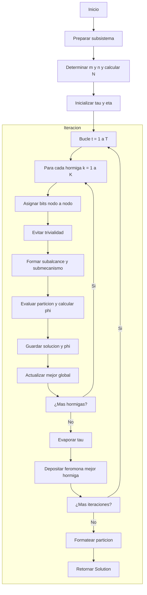

# Algoritmo ACO - Descripción Macroalgorítmica

Este documento explica, de forma macroalgorítmica y paso a paso, cómo emplear **Ant Colony Optimization (ACO)** para resolver tu problema de bipartición de redes. Se basa en la estructura del algoritmo **QNodes** proporcionada, adaptada a la lógica de ACO.

---

## 1. Inicialización y Preparación

1. **Inicializar ACO**: Instanciar la clase `ACO`, que hereda de `SIA` (System Irreducibility Analysis).
2. **Parámetros de entrada**:
   - `condiciones`: string binario que condiciona el sistema.
   - `alcance`: string binario para los nodos "futuros".
   - `mecanismo`: string binario para los nodos "presentes".
3. **Preparar subsistema**:
   ```python
   self.sia_preparar_subsistema(condiciones, alcance, mecanismo)
   ```
4. **Determinar dimensiones**:
   - `futuros` ← `self.sia_subsistema.indices_ncubos` (tamaño m)
   - `presentes` ← `self.sia_subsistema.dims_ncubos` (tamaño n)
   - `N = m + n` (número total de variables)
5. **Configurar parámetros ACO**:
   - `K` = número de hormigas (p. ej. 20–100)
   - `T` = iteraciones máximas (p. ej. 50–200)
   - `α` = peso de la feromona (p. ej. 1.0)
   - `β` = peso de la heurística (p. ej. 2.0)
   - `ρ` = tasa de evaporación (0 < ρ < 1, p. ej. 0.1)
   - `Q` = constante de depósito (p. ej. 1.0)
   - `τ₀` = feromona inicial (p. ej. 1.0)
   - `η` = heurística local (por defecto `1.0` uniforme)

---

## 2. Macroalgoritmo ACO Principal

```pseudo
# 1) Inicializar feromonas y heurística
for i in 0..N-1, g in {0,1} do
  tau[i][g] ← τ₀
  eta[i][g] ←  1.0
end for

best_phi ← +∞
best_dist ← vacío
best_partition ← null

# 2) Iterar T veces
for t in 1..T do
  soluciones ← []
  phi_vals   ← []

  # 2.1) Cada hormiga construye una partición
  for k in 1..K do
    bits[0..N-1] ← 0
    for i in 0..N-1 do
      peso0 ← (tau[i][0]^α) * (eta[i][0]^β)
      peso1 ← (tau[i][1]^α) * (eta[i][1]^β)
      p0 ← peso0 / (peso0 + peso1)
      bits[i] ← muestreo {0 con prob p0, 1 con prob 1-p0}
    end for

    # Evitar trivialidad
    if sum(bits)==0 or sum(bits)==N then
      flip ← índice aleatorio en [0..N-1]
      bits[flip] ← 1 - bits[flip]
    end if

    # Evaluar partición
    subalcance   ← índices i<m donde bits[i]==1
    submecanismo ← índices i>=m donde bits[i]==1 (i-m)
    part         ← subsistema.bipartir(subalcance, submecanismo)
    dist_part    ← part.distribucion_marginal()
    phi          ← distancia_métrica(dist_part, dists_ref)

    soluciones.append(bits)
    phi_vals.append(phi)

    if phi < best_phi then
      best_phi       ← phi
      best_dist      ← dist_part
      best_partition ← formatear(submecanismo, subalcance)
    end if
  end for

  # 2.2) Evaporación
tau ← (1 - ρ) * tau

  # 2.3) Depósito de la mejor hormiga local
idx_mejor ← índice de mínimo en phi_vals
for i in 0..N-1 do
  g ← soluciones[idx_mejor][i]
  tau[i][g] ← tau[i][g] + Q / (phi_vals[idx_mejor] + ε)
end for
end for

# 3) Devolver mejor resultado
devolver(best_phi, best_dist, best_partition)
```

---

## 3. Explicación detallada de **tau** y **eta**

- **tau (τ)** – **Feromona**:
  - Mide la **atracción acumulada** hacia asignar cada nodo al grupo 0 o 1.
  - Se almacena en `tau[i][g]`: mayor valor ⇒ más probabilidad de elegir esa asignación.
  - Se **evapora** (decay) para olvidar soluciones antiguas: `tau ← (1-ρ)*tau`.
  - Las hormigas **refuerzan** sus recorridos buenos añadiendo `+Q/costo`.

- **eta (η)** – **Información heurística**:
  - Indica, **sin feromona**, la calidad esperada de una asignación.
  - Se fija al inicio y **no cambia**.
  - En bipartición sin información previa, se usa uniforme `η[i][g]=1`.
  - Si conoces un criterio local (grado, impacto...), puedes codificarlo aquí.

- **α y β** regulan cuánta importancia dan las hormigas a cada fuente:
  - α alto ⇒ siguen más a la feromona.
  - β alto ⇒ confían más en la heurística.

---

## 4. Ejemplo numérico (N=3)

Supongamos 3 nodos y parámetros muy sencillos:
- K=2 hormigas, T=2 iteraciones, α=β=1, ρ=0.5, Q=1, τ₀=1, η=1.
- dists_ref fijo.

### Iteración 1
1. **Inicialización**:
   ```
   tau = [[1,1], [1,1], [1,1]]
   eta = [[1,1], [1,1], [1,1]]
   ```
2. **Hormiga 1** elige al azar p=½:
   bits = [0,1,0] → φ₁=0.3
   Hormiga 2 → bits=[1,1,0] → φ₂=0.2
3. **Evaporación** (ρ=0.5): todas las tau pasan de 1→0.5
4. **Depósito** de la mejor (hormiga 2) (1/0.2=5) en:
   - tau[0][1]+=5 → 5.5
   - tau[1][1]+=5 → 5.5
   - tau[2][0]+=5 → 5.5

### Iteración 2
- Nuevas probabilidades favorecen [1,1,0]
- Hormiga C genera bits=[1,1,0] → φ=0.15 (mejor global)
- …evaporar y depositar (1/0.15≈6.67)

**Resultado final**: partición `[1,1,0]`, φ=0.15.

---

## 5. Diagrama de flujo


